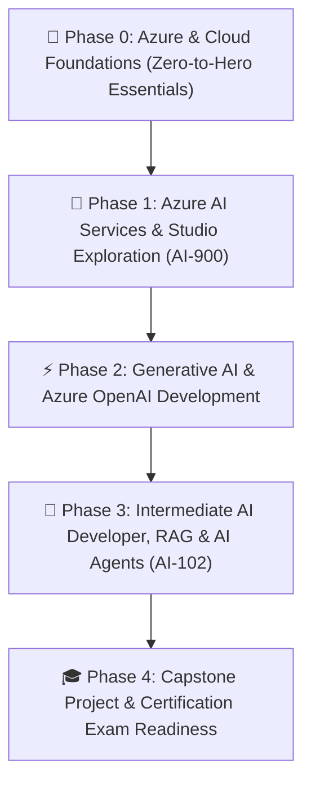

# 🌟 Mina's Zero-to-Hero Azure AI Developer Roadmap

Welcome, Mina! 🌸 This roadmap is designed specifically for you. Even if you have never touched Microsoft Azure or written cloud code before, this step-by-step path will take you from absolute ground zero all the way to becoming a confident **Intermediate Cloud AI Developer** prepared for the **Microsoft Certified: Azure AI Engineer Associate (AI-102)** and **Azure AI Fundamentals (AI-900)** certifications.

---

## 🗺️ Learning Path Overview

---

## 🧭 Phase 0: Azure Foundations (Pre-AI Essentials)
*Goal: Remove all fear of the cloud. Learn to navigate the Azure Portal, organize resources, manage costs, and store data safely.*

### 📍 LAB-000: Azure Portal Safari & Cost Management Safety Net
*   **Goal**: Navigate the Azure Web Portal, set up a zero-dollar budget alert, and understand subscriptions and billing boundaries so you never get unexpected charges.
*   **Real-World Metaphor**: Getting the keys to your new house and setting up the electricity meter monitor.
*   **Key Services**: Azure Portal, Subscriptions, Microsoft Cost Management & Budget Alerts.
*   **Official Study Link**: [Microsoft Learn: Manage Azure Subscriptions](https://learn.microsoft.com/en-us/training/modules/manage-subscriptions-azure-portal/)
*   **Curated Video**: [Azure Portal for Beginners (Microsoft Learn)](https://www.youtube.com/watch?v=NPEsD6n9A_I) *(~6 min)*

### 📍 LAB-001: Resource Groups & Cloud Organization
*   **Goal**: Create and manage Resource Groups, apply custom tags, and learn why grouping resources is the secret to 1-click cloud cleanup.
*   **Real-World Metaphor**: Using labeled plastic organizer bins for each craft project.
*   **Key Services**: Resource Groups, Azure Tags, Azure Resource Manager (ARM).
*   **Official Study Link**: [Microsoft Learn: Manage Resource Groups](https://learn.microsoft.com/en-us/azure/azure-resource-manager/management/manage-resource-groups-portal)

### 📍 LAB-002: Azure Storage Accounts & Blob Containers
*   **Goal**: Create a Storage Account, upload image/text files into a Blob container, and learn how AI models read raw data from the cloud.
*   **Real-World Metaphor**: A digital filing cabinet in the cloud with private and public folders.
*   **Key Services**: Azure Storage Account, Blob Storage (Hot/Cool tiers), Storage Explorer.
*   **Official Study Link**: [Microsoft Learn: Azure Blob Storage Basics](https://learn.microsoft.com/en-us/training/modules/explore-azure-storage-core-services/)

### 📍 LAB-003: Azure Identity, Entra ID & Role-Based Access Control (RBAC)
*   **Goal**: Understand Microsoft Entra ID (formerly Azure AD), assign Contributor/Reader roles, and control who can touch your cloud resources.
*   **Real-World Metaphor**: Security badges with different access levels for building doors.
*   **Key Services**: Microsoft Entra ID, Access Control (IAM), Built-in RBAC Roles.
*   **Official Study Link**: [Microsoft Learn: Azure RBAC Fundamentals](https://learn.microsoft.com/en-us/training/modules/secure-azure-resources-with-rbac/)

### 📍 LAB-004: Azure Key Vault & Secret Management
*   **Goal**: Create a Key Vault to securely store API keys and connection strings without ever hardcoding passwords into your code.
*   **Real-World Metaphor**: A high-security fireproof safe inside your cloud office.
*   **Key Services**: Azure Key Vault, Secrets, Keys, Access Policies.
*   **Official Study Link**: [Microsoft Learn: Manage Secrets with Key Vault](https://learn.microsoft.com/en-us/training/modules/manage-secrets-with-azure-key-vault/)

### 📍 LAB-005: Azure Serverless Functions (Running Cloud Code)
*   **Goal**: Deploy a lightweight serverless Python function via the Portal and test sending and receiving JSON requests.
*   **Real-World Metaphor**: A smart doorbell that only rings and uses power when a visitor presses the button.
*   **Key Services**: Azure Function App, Consumption Plan, HTTP Triggers.
*   **Official Study Link**: [Microsoft Learn: Create Serverless Logic](https://learn.microsoft.com/en-us/training/modules/create-serverless-logic-with-azure-functions/)

---

## 🤖 Phase 1: Azure AI Services & Visual Studios (AI-900 Prep)
*Goal: Explore ready-to-use AI models using Microsoft's visual studios—no deep math or complex coding required!*

### 📍 LAB-006: Azure AI Foundry & Multi-Service Account Setup
*   **Goal**: Provision an Azure AI Services multi-service resource and tour the new Azure AI Foundry hub.
*   **Key Services**: Azure AI Services, Azure AI Foundry Hub, Endpoint & API Keys.
*   **Official Study Link**: [Microsoft Learn: Azure AI Services Overview](https://learn.microsoft.com/en-us/azure/ai-services/what-are-ai-services)

### 📍 LAB-007: Azure AI Vision (Image Captioning & Object Detection)
*   **Goal**: Use Vision Studio in your browser to extract tags, detect objects in images, and read printed text with OCR.
*   **Key Services**: Azure Vision Studio, Computer Vision API, Image Analysis 4.0.
*   **Official Study Link**: [Microsoft Learn: Analyze Images with Computer Vision](https://learn.microsoft.com/en-us/training/modules/analyze-images-computer-vision/)

### 📍 LAB-008: Azure AI Document Intelligence (Smart Invoice & Form Extraction)
*   **Goal**: Automatically extract structured tables, total amounts, and dates from PDF receipts and invoices using prebuilt models.
*   **Key Services**: Document Intelligence Studio, Prebuilt Invoice/Receipt Models.
*   **Official Study Link**: [Microsoft Learn: Extract Data from Forms](https://learn.microsoft.com/en-us/training/modules/use-prebuilt-form-recognizer-models/)

### 📍 LAB-009: Azure AI Language (Sentiment Analysis & PII Redaction)
*   **Goal**: Analyze customer reviews for positive/negative sentiment and automatically detect and redact sensitive personal information (PII).
*   **Key Services**: Language Studio, Sentiment Analysis, Named Entity Recognition (NER), PII Detection.
*   **Official Study Link**: [Microsoft Learn: Extract Insights from Text](https://learn.microsoft.com/en-us/training/modules/analyze-text-with-azure-language-service/)

### 📍 LAB-010: Azure AI Speech (Text-to-Speech & Speech-to-Text)
*   **Goal**: Convert voice recordings into written transcripts and synthesize realistic human-like voices in multiple languages.
*   **Key Services**: Speech Studio, Speech-to-Text, Neural Text-to-Speech (TTS).
*   **Official Study Link**: [Microsoft Learn: Transcribe Speech](https://learn.microsoft.com/en-us/training/modules/transcribe-speech-input/)

### 📍 LAB-011: Responsible AI & Azure AI Content Safety
*   **Goal**: Configure safety guardrails, detect harmful prompt injections, and filter toxic language using Content Safety Studio.
*   **Key Services**: Azure AI Content Safety, Prompt Shields, Text Moderation.
*   **Official Study Link**: [Microsoft Learn: Responsible AI Principles](https://learn.microsoft.com/en-us/training/modules/embrace-responsible-ai-principles-practices/)

---

## ⚡ Phase 2: Generative AI & Azure OpenAI Developer Core
*Goal: Master Large Language Models (LLMs), prompt engineering, embeddings, and vector search.*

### 📍 LAB-012: Azure OpenAI Studio & Deploying GPT Models
*   **Goal**: Create an Azure OpenAI resource, deploy `gpt-4o-mini`, and interact with the model in the Web Chat Playground.
*   **Key Services**: Azure OpenAI Studio, Model Deployments, Tokens & Quotas.
*   **Official Study Link**: [Microsoft Learn: Get Started with Azure OpenAI](https://learn.microsoft.com/en-us/training/modules/get-started-openai/)

### 📍 LAB-013: Prompt Engineering & System Message Mastery
*   **Goal**: Learn system prompts, few-shot examples, temperature, and top-p tuning to control model behavior and eliminate hallucinations.
*   **Key Services**: Azure OpenAI Playground, System Prompts, Python `openai` SDK.
*   **Official Study Link**: [Microsoft Learn: Apply Prompt Engineering](https://learn.microsoft.com/en-us/training/modules/apply-prompt-engineering-azure-openai/)

### 📍 LAB-014: Text Embeddings & Vector Representations
*   **Goal**: Generate numerical vector embeddings for text using `text-embedding-3-small` and calculate cosine similarity between concepts.
*   **Real-World Metaphor**: Giving every idea GPS coordinates so similar ideas sit close to each other on a map.
*   **Key Services**: Azure OpenAI Embeddings, NumPy / Python vector math.
*   **Official Study Link**: [Microsoft Learn: Understand Embeddings](https://learn.microsoft.com/en-us/azure/ai-services/openai/concepts/understand-embeddings)

### 📍 LAB-015: Azure AI Search & Vector Indexing
*   **Goal**: Deploy an Azure AI Search service, create a vector index, and perform hybrid searches (keyword + semantic vector search).
*   **Key Services**: Azure AI Search, Vector Indexes, Semantic Ranker.
*   **Official Study Link**: [Microsoft Learn: Vector Search in Azure AI Search](https://learn.microsoft.com/en-us/azure/search/vector-search-overview)

### 📍 LAB-016: Retrieval-Augmented Generation (RAG) - Chat with Your Own Data
*   **Goal**: Build a complete RAG pipeline connecting Azure OpenAI with your private PDF knowledge base stored in Azure Blob Storage.
*   **Key Services**: Azure OpenAI "Add your data", Azure AI Search, Azure Blob Storage.
*   **Official Study Link**: [Microsoft Learn: Use Your Own Data with Azure OpenAI](https://learn.microsoft.com/en-us/training/modules/use-own-data-azure-openai/)

### 📍 LAB-017: Function Calling & Tool Execution with LLMs
*   **Goal**: Teach GPT models to call external Python functions (e.g., fetch weather data, query an order database) to solve real-world tasks.
*   **Key Services**: Azure OpenAI Tool Calling, JSON Schemas, Python SDK.
*   **Official Study Link**: [Microsoft Learn: Function Calling with Azure OpenAI](https://learn.microsoft.com/en-us/azure/ai-services/openai/how-to/function-calling)

### 📍 LAB-018: Multi-Turn Conversation History & Memory Management
*   **Goal**: Manage chat conversation state, sliding context windows, and conversation token limits in Python.
*   **Key Services**: Chat Completion API, Token Management, Conversation Buffers.

---

## 🚀 Phase 3: Intermediate AI Developer, Agents & Production Systems (AI-102)
*Goal: Build production-grade autonomous AI assistants, secure them with enterprise identity, and monitor AI quality.*

### 📍 LAB-019: Azure AI Agent Service & Assistant Workflows
*   **Goal**: Build autonomous AI agents with code interpreter, file search, and custom tools using the Azure AI Agent Service.
*   **Key Services**: Azure AI Agent Service, Threads, Runs, Code Interpreter Tool.
*   **Official Study Link**: [Microsoft Learn: Azure AI Agent Service](https://learn.microsoft.com/en-us/azure/ai-services/agents/overview)

### 📍 LAB-020: Passwordless AI Security (Managed Identities & RBAC)
*   **Goal**: Remove all API keys from your code and authenticate your application to Azure OpenAI and Azure AI Search using Azure Managed Identities (`DefaultAzureCredential`).
*   **Key Services**: User-Assigned Managed Identity, Azure RBAC Cognitive Services Roles, `azure-identity` Python library.
*   **Official Study Link**: [Microsoft Learn: Authenticate to Azure AI with Entra ID](https://learn.microsoft.com/en-us/azure/ai-services/authentication)

### 📍 LAB-021: AI Monitoring, Observability & Evaluation
*   **Goal**: Track token usage, latency, and evaluate LLM output quality (groundedness, relevance, coherence) using Azure Application Insights and Azure AI Studio evaluations.
*   **Key Services**: Azure Application Insights, Azure AI Evaluation SDK, Metrics Tracing.
*   **Official Study Link**: [Microsoft Learn: Evaluate Generative AI Applications](https://learn.microsoft.com/en-us/azure/ai-studio/concepts/evaluation-approach-gen-ai)

### 📍 LAB-022: Multi-Modal AI (Vision + Audio + Text Integration)
*   **Goal**: Build an AI application that accepts an uploaded image, transcribes a voice question about it, and speaks the answer back aloud.
*   **Key Services**: GPT-4o Vision, Azure AI Speech, Python FastAPI / Streamlit.

---

## 🎓 Phase 4: Capstone Project & Certification Exam Readiness
*Goal: Synthesize all skills into an enterprise portfolio project and lock in certification readiness.*

### 📍 LAB-023: End-to-End Enterprise AI Knowledge Assistant (Capstone Project)
*   **Goal**: Build a complete, production-ready enterprise copilot with RAG, vector search, streaming responses, Content Safety guardrails, and a modern web UI.
*   **Architecture**: Azure Blob Storage -> Azure AI Search -> Azure OpenAI (GPT-4o) -> Content Safety -> Web UI.

### 📍 LAB-024: AI-102 & AI-900 Certification Practice Marathon
*   **Goal**: Complete 50 exam-simulation questions covering all domains of the AI-102 and AI-900 exam blueprints with full rationale breakdowns.
*   **Official Exam Blueprint**: [Microsoft AI-102 Exam Study Guide](https://learn.microsoft.com/en-us/credentials/certifications/resources/study-guides/ai-102)

---

## 📝 Mina's Progress Tracker

| Lab # | Lab Title | Status | Notes / Comments Link |
| :---: | :--- | :---: | :--- |
| **000** | [Azure Portal Safari & Cost Management](file:///c:/Users/a528684/Desktop/file/dev/personal/az/ai-labs-mina/lab-000-portal-cost-safety/README.md) | 🚀 Ready to Practice | [comments.md](file:///c:/Users/a528684/Desktop/file/dev/personal/az/ai-labs-mina/lab-000-portal-cost-safety/comments.md) |
| **001** | [Resource Groups & Cloud Organization](file:///c:/Users/a528684/Desktop/file/dev/personal/az/gp/ai-labs-mina/lab-001-resource-groups/README.md) | 🚀 Ready to Practice | [comments.md](file:///c:/Users/a528684/Desktop/file/dev/personal/az/gp/ai-labs-mina/lab-001-resource-groups/comments.md) |
| **002** | Azure Storage Accounts & Blob Containers | ⏳ Not Started | [comments.md](file:///c:/Users/a528684/Desktop/file/dev/personal/az/ai-labs-mina/lab-002-blob-storage/comments.md) |
| **003** | Azure Identity & Access Control (RBAC) | ⏳ Not Started | [comments.md](file:///c:/Users/a528684/Desktop/file/dev/personal/az/ai-labs-mina/lab-003-rbac-identity/comments.md) |
| **004** | Azure Key Vault & Secrets | ⏳ Not Started | [comments.md](file:///c:/Users/a528684/Desktop/file/dev/personal/az/ai-labs-mina/lab-004-key-vault/comments.md) |
| **005** | Azure Serverless Functions | ⏳ Not Started | [comments.md](file:///c:/Users/a528684/Desktop/file/dev/personal/az/ai-labs-mina/lab-005-serverless-functions/comments.md) |
| **006** | Azure AI Foundry Hub Setup | ⏳ Not Started | [comments.md](file:///c:/Users/a528684/Desktop/file/dev/personal/az/ai-labs-mina/lab-006-ai-foundry-setup/comments.md) |
| **007** | Azure AI Vision Studio & OCR | ⏳ Not Started | [comments.md](file:///c:/Users/a528684/Desktop/file/dev/personal/az/ai-labs-mina/lab-007-vision-studio/comments.md) |
| **008** | Azure AI Document Intelligence | ⏳ Not Started | [comments.md](file:///c:/Users/a528684/Desktop/file/dev/personal/az/ai-labs-mina/lab-008-doc-intelligence/comments.md) |
| **009** | Azure AI Language Studio | ⏳ Not Started | [comments.md](file:///c:/Users/a528684/Desktop/file/dev/personal/az/ai-labs-mina/lab-009-language-studio/comments.md) |
| **010** | Azure AI Speech Studio | ⏳ Not Started | [comments.md](file:///c:/Users/a528684/Desktop/file/dev/personal/az/ai-labs-mina/lab-010-speech-studio/comments.md) |
| **011** | Content Safety & Responsible AI | ⏳ Not Started | [comments.md](file:///c:/Users/a528684/Desktop/file/dev/personal/az/ai-labs-mina/lab-011-content-safety/comments.md) |
| **012** | Azure OpenAI Studio & GPT-4o | ⏳ Not Started | [comments.md](file:///c:/Users/a528684/Desktop/file/dev/personal/az/ai-labs-mina/lab-012-openai-studio/comments.md) |
| **013** | Prompt Engineering & System Prompts | ⏳ Not Started | [comments.md](file:///c:/Users/a528684/Desktop/file/dev/personal/az/ai-labs-mina/lab-013-prompt-engineering/comments.md) |
| **014** | Text Embeddings & Vector Math | ⏳ Not Started | [comments.md](file:///c:/Users/a528684/Desktop/file/dev/personal/az/ai-labs-mina/lab-014-embeddings/comments.md) |
| **015** | Azure AI Search & Vector Indexing | ⏳ Not Started | [comments.md](file:///c:/Users/a528684/Desktop/file/dev/personal/az/ai-labs-mina/lab-015-ai-search/comments.md) |
| **016** | RAG (Chat with Your Own Data) | ⏳ Not Started | [comments.md](file:///c:/Users/a528684/Desktop/file/dev/personal/az/ai-labs-mina/lab-016-rag-system/comments.md) |
| **017** | Function Calling & Tool Calling | ⏳ Not Started | [comments.md](file:///c:/Users/a528684/Desktop/file/dev/personal/az/ai-labs-mina/lab-017-function-calling/comments.md) |
| **018** | Multi-Turn Conversation Memory | ⏳ Not Started | [comments.md](file:///c:/Users/a528684/Desktop/file/dev/personal/az/ai-labs-mina/lab-018-chat-memory/comments.md) |
| **019** | Azure AI Agent Service | ⏳ Not Started | [comments.md](file:///c:/Users/a528684/Desktop/file/dev/personal/az/ai-labs-mina/lab-019-ai-agent-service/comments.md) |
| **020** | Passwordless AI Security (Entra ID) | ⏳ Not Started | [comments.md](file:///c:/Users/a528684/Desktop/file/dev/personal/az/ai-labs-mina/lab-020-managed-identity/comments.md) |
| **021** | AI Monitoring & Application Insights | ⏳ Not Started | [comments.md](file:///c:/Users/a528684/Desktop/file/dev/personal/az/ai-labs-mina/lab-021-ai-monitoring/comments.md) |
| **022** | Multi-Modal AI Assistant | ⏳ Not Started | [comments.md](file:///c:/Users/a528684/Desktop/file/dev/personal/az/ai-labs-mina/lab-022-multimodal-assistant/comments.md) |
| **023** | Enterprise AI Capstone Project | ⏳ Not Started | [comments.md](file:///c:/Users/a528684/Desktop/file/dev/personal/az/ai-labs-mina/lab-023-capstone-project/comments.md) |
| **024** | AI-102 Exam Practice Marathon | ⏳ Not Started | [comments.md](file:///c:/Users/a528684/Desktop/file/dev/personal/az/ai-labs-mina/lab-024-exam-marathon/comments.md) |
